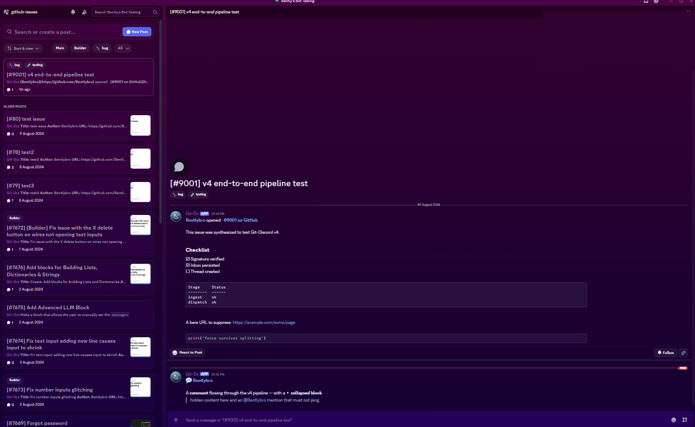

# Git-Discord

**A bridge between GitHub and Discord.** Every issue and pull request becomes a Discord forum thread. Comments, labels, reviews and state changes flow between the two in real time, and anyone who links their GitHub account can act on GitHub from inside Discord, as themselves.

Built in 2023, rebuilt from scratch in 2026. The current version (v4) runs in production mirroring several repositories across multiple Discord servers, including the [AutoGPT](https://github.com/Significant-Gravitas/AutoGPT) community server, where it carries a few years of issue history.

📖 **[Read the full story and architecture write-up →](https://bentlybro.com/posts/building-git-discord-three-years-of-bridging-github-and-discord)**



---

## What it does

**Mirrors GitHub into Discord forum channels**

- Every issue and PR gets a forum thread named `[#1234] The issue title`
- Comments, edits and deletions sync as they happen
- GitHub labels become Discord forum tags, created automatically with a fitting emoji (`bug` → 🐛, `security` → 🔒)
- Opens, closes, merges, reopens and reviews land as colour-coded embeds using GitHub's own palette
- Threads archive when the issue closes, and reopen when it does

**Lets people act on GitHub from Discord**

Link your GitHub account once with `/link` and everything you do is authored by *your* GitHub account, not a bot account.

| Command | What it does |
| --- | --- |
| `/comment` | Post a comment to the issue or PR from its thread |
| `/close` · `/reopen` | Change state, with an optional reason |
| `/react` | Any GitHub reaction: 👍 👎 😄 🎉 😕 ❤️ 🚀 👀 |
| `/issue` | Open a new GitHub issue from Discord |
| `/link` · `/unlink` | Connect or disconnect your GitHub account |
| `/follow` · `/unfollow` · `/following` | Opt in to updates on an issue |
| `/notifications` | Your personal notification preferences |
| `/status` · `/help` | Bot health and command reference |

Admins get `/repo add|remove|list|config|bots` and `/admin resync|stats|deadletter|retry` for configuring everything from inside Discord. Nothing is hardcoded.

## Design principles

**Notifications are opt-in, always.** The bot never adds anyone to a thread. Mirrored content is posted with mentions suppressed, so nothing pings, even if a GitHub comment contains `@everyone`. If you want updates on an issue you `/follow` it, and DMs are batched into digests so an active thread sends you one updating message instead of twenty.

**Quiet by default.** Modern repos are loud: CI bots, review bots, coverage bots, each posting essays. Known bots collapse to a single one-line embed with a link to the full output, configurable per repository, so threads stay conversations between humans with machine annotations rather than the other way around.

**No lost events.** GitHub does not redeliver webhooks, so every event is written to a database inbox *before* the request is acknowledged, then processed asynchronously with per-issue ordering, retries and a dead-letter queue. Restarting or redeploying the bot drops nothing.

**Markdown that actually renders.** GitHub and Discord both speak "markdown" and disagree about nearly everything. A dedicated transformation engine rewrites one into the other: tables become aligned text, `<details>` blocks collapse to a summary and a link, badges flatten into a single link, bare URLs are wrapped so nothing unfurls, and long comments split at word boundaries while keeping code fences intact across the split.

**Your identity, not the bot's.** GitHub OAuth with signed state tokens; tokens are encrypted at rest and can be removed at any time with `/unlink`.

## Under the hood

A single Python process running one asyncio event loop, with `discord.py` and an `aiohttp` web server sharing it.

```
GitHub webhook → verify + parse → webhook_inbox (SQLite)
                                        ↓
                       keyed executor (FIFO per issue, retries)
                                        ↓
                    dispatcher (policy + echo suppression gates)
                                        ↓
                          handlers → Discord forum thread
```

Handlers are idempotent and self-healing: GitHub makes no ordering promises, so a comment arriving before the issue it belongs to simply creates the thread from the data embedded in its own payload. Processing the same event twice produces the same result as processing it once.

The formatting engine is pure functions covered by golden-file tests, and it is idempotent too, which matters because every GitHub edit re-renders its Discord mirror.

## Status

Running in production. The source for v4 is not public at the moment.

The versions from 2023 and 2024 are what this repository originally documented; v4 is a complete rewrite sharing none of their code.

**Coming soon:** reply sync, so typing normally in a mirrored thread posts to GitHub as your comment without needing a command. Built and tested, currently awaiting Discord's privileged intent review.

## Privacy

The bot's privacy policy is served by the bot itself at **[wh.bentlybro.com/privacy](https://wh.bentlybro.com/privacy)**.

Short version: it stores account links (GitHub tokens encrypted at rest), message-to-comment ID mappings, and your notification preferences. It never stores message content, never sells or shares data, and never trains anything on it.

---

Built by [Bently](https://github.com/Bentlybro).
